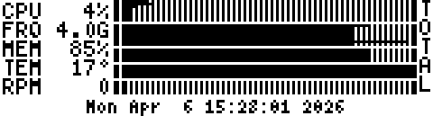

# G15STATS

G15Stats is a system statistics monitor for Logitech G15 LCD displays, using
[G15Daemon](https://g15daemon.sourceforge.net/). It shows CPU load, memory, swap, network, temperatures, fan speed,
battery status, and CPU frequency screens.



## Quick Start

Build and run locally:

```bash
./configure
make
./g15stats
```

Install system-wide:

```bash
make install
```

For full setup guidance (including sensors and service setup), see
[`docs/installation-tutorial.md`](docs/installation-tutorial.md).

## Highlights

- Multiple screens with per-screen modes (`L4`) and info/submode toggles (`L5`).
- YAML config support (default `/etc/g15plugins/g15stats.yaml`).
- Output-to-file mode for testing and offline frame capture.
- Works with dynamic CPU/core layouts and aggregate visualizations.

## Screen Overview

G15Stats includes these primary screens:

- `SUMMARY`: Combined system overview (CPU, memory, swap, network, sensors, time)
- `CPU LOAD`: Classic CPU load view
- `CPU LOAD2`: Grouped CPU load view with horizontal/vertical mode toggle
- `CPU FREQ AGG`: Aggregate CPU frequency comparison
- `MEMORY`: Memory usage and composition
- `SWAP`: Swap usage and paging activity
- `NETWORK` and `NETWORK PEAK`: Throughput history, current and peak rates
- `BATTERY`: Battery charge/state (when available)
- `TEMPERATURE`: Temperature sensors (when available)
- `FAN`: Fan speed sensors (when available)

For screenshots of every screen and mode, see
[`docs/screens.md`](docs/screens.md).

## Navigation

- `L2`: Previous screen
- `L3`: Next screen
- `L4`: Toggle mode for current screen
- `L5`: Toggle submode / info rotation

## Common Options

- `-i <iface>`: Monitor a specific network interface (example: `-i eth0`)
- `-d`: Run as daemon
- `-r <seconds>`: Refresh interval (1..300)
- `-u`: Unicore CPU graph mode
- `-t <id>` / `-f <id>`: Force temp/fan sensor id
- `-gt <id>`: Show selected temperature id in summary
- `-df`: Disable CPU frequency monitoring
- `-ir`: Rotate bottom info bar content
- `-vc`: Re-detect CPU core count continuously (hotplug systems)
- `-o <file>`: Write LCD frames to file instead of g15daemon
- `-D`: Enable debug logging

For complete option details, see [`docs/options.md`](docs/options.md).

## Documentation

Start here:

- [`docs/index.md`](docs/index.md)
- [`docs/installation.md`](docs/installation.md)
- [`docs/installation-tutorial.md`](docs/installation-tutorial.md)
- [`docs/usage.md`](docs/usage.md)
- [`docs/options.md`](docs/options.md)
- [`docs/screens.md`](docs/screens.md)

You can also browse rendered docs with MkDocs:

```bash
uv run mkdocs serve
```

## Credits

This project builds on work from earlier contributors, including:

- Mike Lampard
- Piotr Czarnecki
- Antonio Bartolini
- Daniel Menelkir

See [`AUTHORS`](AUTHORS) for the original contributor listing.
