# Screens

This page is generated by `tests/update_screens_docs.sh`.

- `Mode 0` and `Mode 1` are triggered by `L4`.
- Images are rendered from real frame dumps and upscaled `3x` (480x129 minimum) for readability.
- Some screens do not change with mode, so `Mode 0` and `Mode 1` may look identical.

## Navigation Buttons

| Button | Action |
|--------|--------|
| **L2** | Previous screen |
| **L3** | Next screen |
| **L4** | Toggle mode for current screen |
| **L5** | Toggle submode / info rotation |

## Screen 0 - SUMMARY

Mode 0

Mode 1

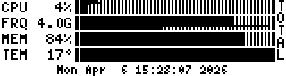

## Screen 1 - CPU LOAD

Mode 0

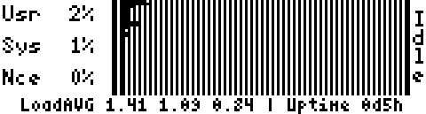

Mode 1

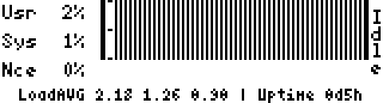

## Screen 2 - CPU LOAD2

Mode 0

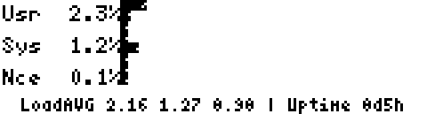

Mode 1

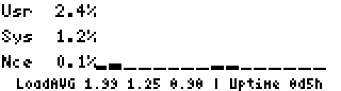

## Screen 3 - CPU FREQ

Mode 0

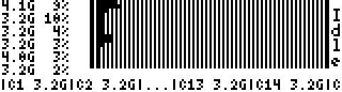

Mode 1

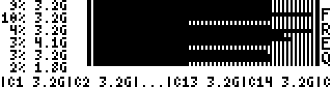

## Screen 4 - CPU FREQ AGG

Mode 0

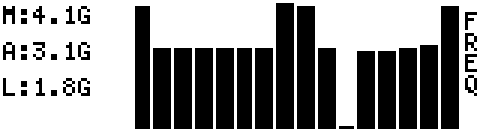

Mode 1

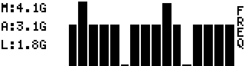

## Screen 5 - MEMORY

Mode 0

Mode 1

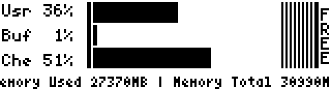

## Screen 6 - SWAP

Mode 0

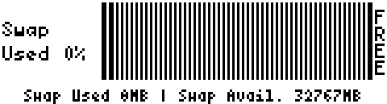

Mode 1

## Screen 7 - NETWORK

Mode 0

Mode 1

## Screen 8 - BATTERY

Mode 0

Mode 1

## Screen 9 - TEMPERATURE

Mode 0

Mode 1

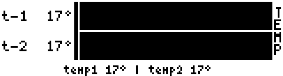

## Screen 10 - FAN

Mode 0

Mode 1

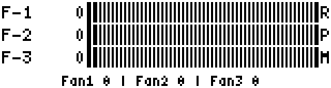
